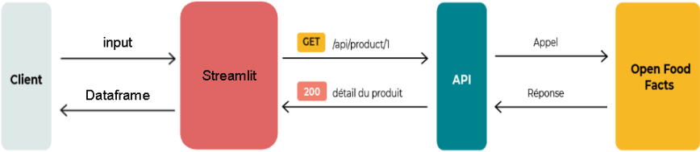

# 🥦 Streamlit - Analyse Nutriscore et Ecoscore via Open Food Facts

## 📌 Contexte

Ce projet a été réalisé dans le cadre d’un exercice de data analyse et visualisation. L’objectif est de proposer une application simple permettant à un utilisateur de **vérifier la qualité nutritionnelle et environnementale des produits alimentaires** qu’il envisage d’acheter.

---

## ❓ Problématique

- Comment permettre à un utilisateur d'effectuer une recherche rapide d’un produit alimentaire ?
- Comment récupérer, structurer et afficher les données nutritionnelles et écologiques associées ?
- Comment rendre l’interface accessible même à des utilisateurs non techniques ?
- Comment gérer les produits absents ou dont les données sont incomplètes ?

---

## 🛠️ Choix technologiques



- **[Streamlit](https://streamlit.io/)** : Création rapide d’interface web interactive.
- **[Open Food Facts API](https://world.openfoodfacts.org/data)** : Fournisseur de données sur les produits alimentaires.
- **Requests** : Pour interroger l'API de façon simple.
- **Pandas** : Pour structurer et nettoyer les données.
- **Streamlit Download Button** : Pour permettre à l’utilisateur d’extraire les données (CSV/JSON).

---

## 🧱 Architecture de l'application


L'application est structurée de manière modulaire dans un dossier `app/`, avec les fichiers suivants :
```plaintext
app/
├── __init__.py       # Rend le dossier app importable comme un module Python
├── app.py            # Point d'entrée principal de l'application Streamlit
├── functions.py      # Fonctions utilitaires pour requêter l'API et traiter les données
└── requirements.txt  # Liste des dépendances nécessaires
assets/               # Dossier pour les ressources statiques (images, etc.)
└── image.png         # Image utilisée dans le README
```

---

## 🚀 Fonctionnalités

- 🔍 Recherche par nom de produit.
- 🧾 Affichage des données principales : 
  - Brand
  - Lang
  - Nutrition Grade (Nutri-Score)
  - Ecoscore_grade (Eco-Score)
  - Product_name
- ⚠️ Gestion des données manquantes ou non trouvées.
- 📁 Export des résultats en CSV ou JSON.

---

## ⚙️ Installation et lancement

1. **Cloner le dépôt :**

```bash
git clone https://github.com/ton-utilisateur/ton-projet.git
cd ton-projet
```
2. **Installer les dépendances :**

```bash
pip install -r requirements.txt
```

3. **Lancer l'application :**

```bash
streamlit run app.py
```

4. **Accéder à l'application :** Ouvrez votre navigateur et allez à `http://localhost:8501`.

---

## ❗ Problèmes rencontrés 
- Données incomplètes : Certains produits ne disposent pas d’eco-score ou nutriscore → mise en place de messages d’alerte ou de valeur par défaut.

- Résultats bruités : L’API retourne parfois des résultats approximatifs, notament pour les langues, même en choisissant une langue précise, l'API retourne quand même de mauvais résultats.

---

## 📚 Ressources utiles

- [Documentation API Open Food Facts](https://world.openfoodfacts.org/data)
- [Documentation officielle de Streamlit](https://docs.streamlit.io/)
- [Documentation Pandas](https://pandas.pydata.org/docs/)
- [Requests](https://docs.python-requests.org/)
